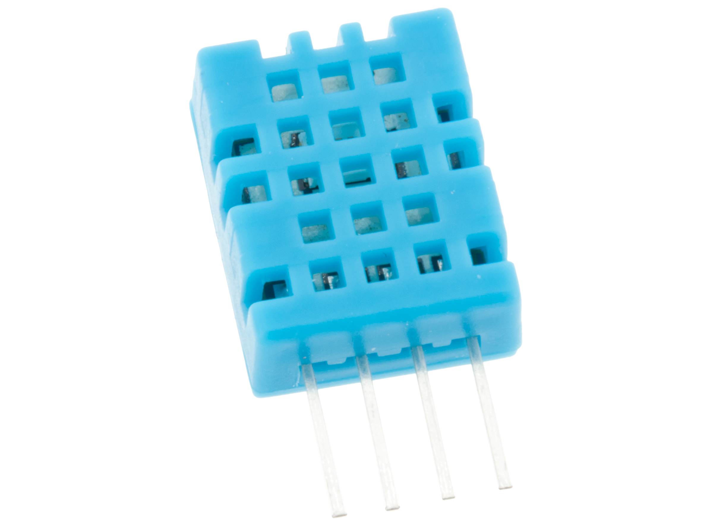
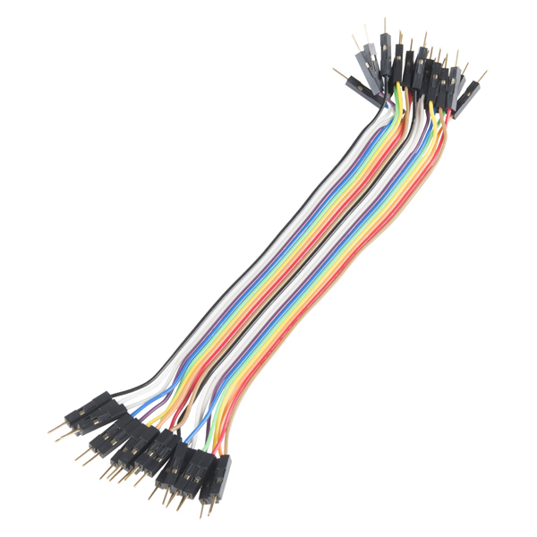
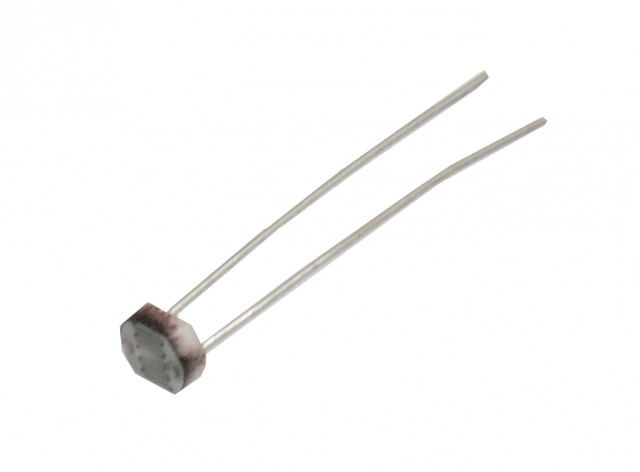
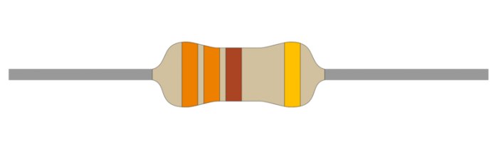
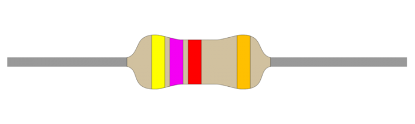
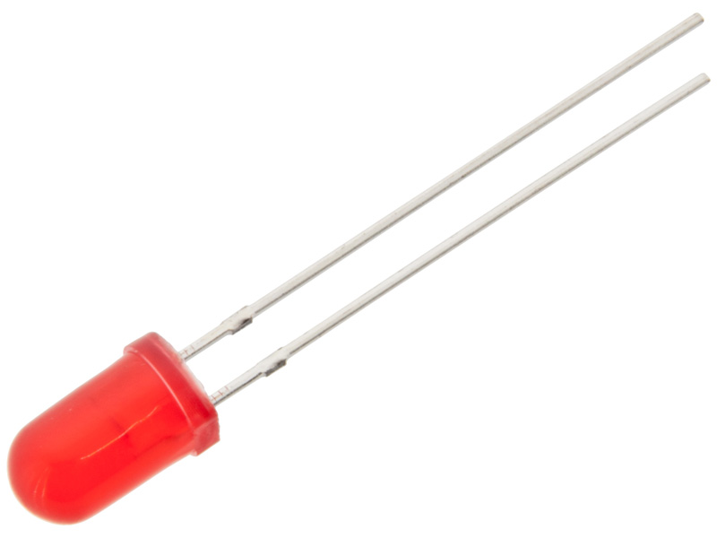
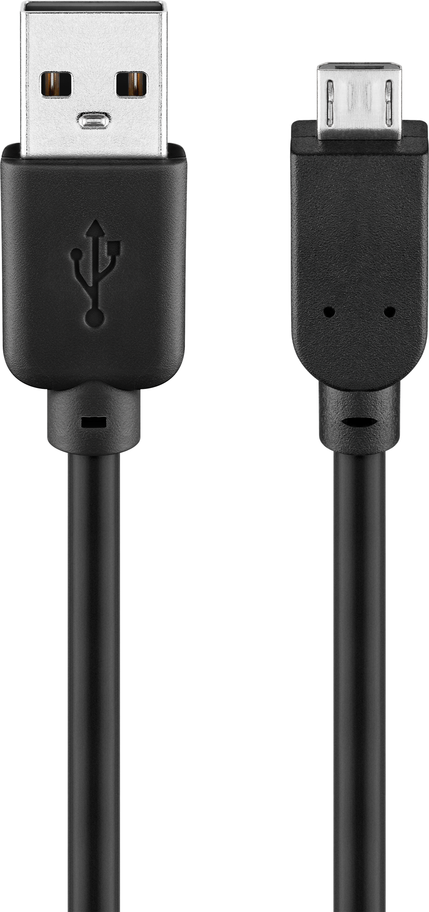
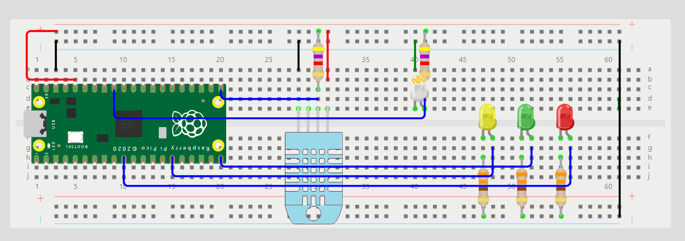
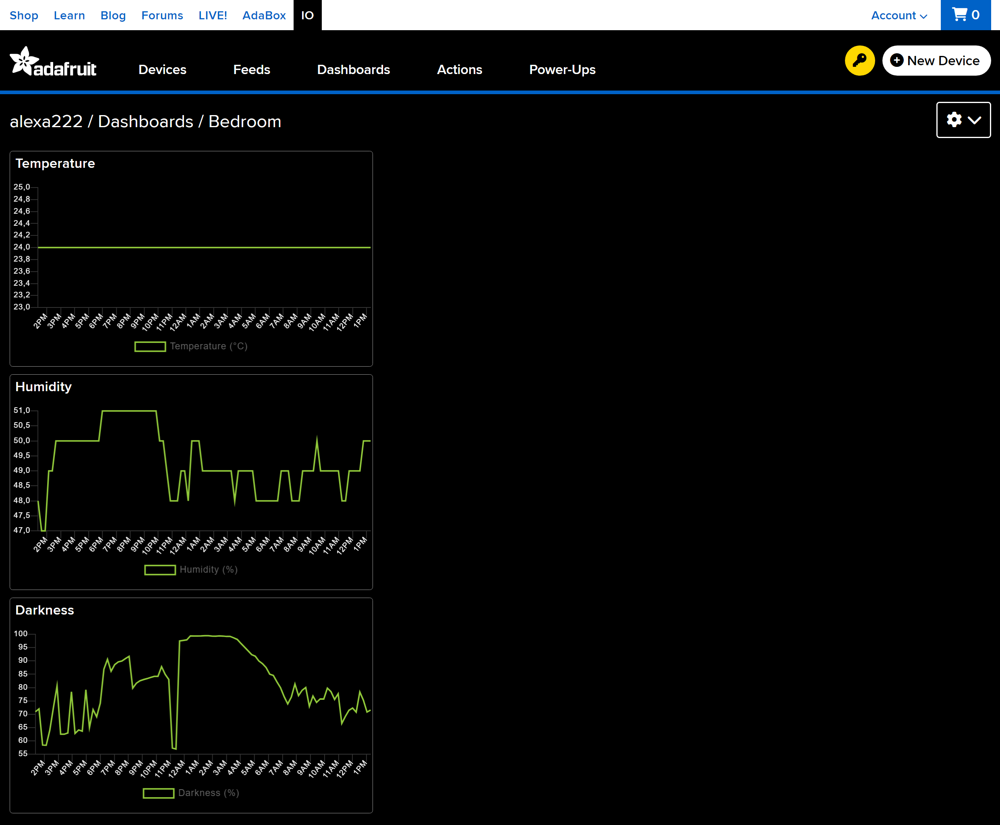

# Bedroom Environment Monitor for Improved Sleep Quality
By Alexandra Papadopoulos (ap224jv)

# Overview and duration
Ensuring good sleep is essential for maintaining a healthy lifestyle, and various environmental factors such as temperature, lighting, and humidity play a significant role in sleep quality. I developed a device that monitors these factors by collecting sensor data and sending it to a cloud platform for analysis.

The project involves using a Raspberry Pi Pico WH microcontroller, a DHT11 sensor for temperature and humidity, and a photoresistor for measuring light intensity. The device continuously monitors the environment, controls LED indicators based on thresholds, and sends data to Adafruit IO, a cloud-based service, for visualization and analysis, via WiFi.

Following this tutorial you would likely be able to build this device in around 5 hours. 

# Objective
Good sleep is an important factor in having a health lifestyle. The quality of sleep is affected by the environment, such as the temperature, lighting and humidity. To get a better understanding of the bedroom environment, I decided to create a device that measures these factors and sends the data to a platform where they can be analysed. This analysis could give insight in how to change the environment in which I sleep, in order to improve sleep quality.

The optimal temperature for sleeping is 18-19 °C, and the ideal humidity range is between 40-60%. In this project, the light intensity will not be measured precisely in lux. Instead, the photoresistor will measure the resistance, which decrease non-linearly as the sensor is exposed to more light. I will define a percentage of darkness based on these resistance values and then determine the desired darkness level for my room at bedtime. The desired darkness percentage was set to 90%.

The measured data will be sent to Adafruit IO for storage and analysis. Additionally, LED lights will illuminate when the temperature, humidity or darkness of the room is not optimal during bedtime.

The choice to use LEDs as indicators of a non-optimal environment was made so that I can quickly see the status without having to use my phone or open my computer. The main reason for this choice is that these devices should be avoided before bedtime to maintain good sleep quality.

# Material
In the following table the products needed to build this device is presented, as well as the cost of each component. Each item was bought from Electrokit.com, except for the power bank, which I already had at home and do not know the exact price of or where it was bought.

| Product name | Description |  Cost |
|--------------|-------------|-------|
|   | Raspberry Pi Pico WH (x1). A microcontroller board with pre-soldered header pins for easy connectivity. It features the RP2040 microcontroller, dual-core Arm Cortex-M0+ processors, USB connectivity, and support for programming in MicroPython and C/C++. Ideal for various electronics projects and IoT applications. | 109 kr |
|  | DHT11 (x1). A basic, ultra low-cost digital temperature and humidity sensor. | 39 kr |
|   | Breadboard 840 connections (x1). A solderless device for temporary prototype with electronics and test circuit designs. | 69 kr |
|  | Jumper wires 30cm male/male (x20). Used for making quick and easy connections on a breadboard or female header connectors. | 29 kr (för 20) |
|  | Photo resistor CdS 4-7 kohm (x1). A photoresistor, also known as a light-dependent resistor (LDR), is a type of resistor whose resistance varies depending on the amount of light falling on its surface. | 8 kr |
|   | Resistors (330 ohm) (x3). Used to limit the current in an electronic circuit. | 1 kr |
|   | Resistors (47000 ohm) (x3). Used to limit the current in an electronic circuit. | 3 kr |
|   | LED 5mm (Preferably different colours) (x3). Light-emitting diodes used as indicator lights. | 5 kr |
|   | USB-kabel A-hane - micro B hane 1.8m (x1).  | 39 kr |
| | Power bank (x1).  | ca 200 kr |

This results in a total cost of 520 kr.

# Computer setup
The project was developed in Visual Studio Code using Micropython programming language on a Windows computer. The following steps will take you through how the computer was set up.

### Step 1 Node.js:
Download and install Node.js LTS to your computer.

### Step 2 VS Code:
Download and install Visual Studio Code to your computer.

### Step 3 Pymakr:
Add the Pymakr plugin to VS Code, using the Extensions manager.

### Step 4 Firmware:
The next step is to download the micropython firmware for Raspberry Pi Pico W from https://micropython.org/download/RPI_PICO_W/. Then connect the Raspbery Pi Pico to your computer while holding the BOOTSEL button on the board down. Let go of the button and add the downloaded firmware to your Raspbery Pi Pico. Now the firmware is installed. 

### Step 5 Uploading the code:
Create a project in the Pymakr extention, press add device and select your Raspberry Pi Pico W. Make sure to put your project on development mode, then the changes made to the project file will automatically be uploaded to the device when you save it. 

For more details see these tutorials:
* [Installing VS Code IDE](https://hackmd.io/@lnu-iot/rkiTJj8O9)
* [Update Firmware on Raspberry Pi Pico W](https://hackmd.io/@lnu-iot/rkFw7gao_)
# Putting everything together
Figure 1 shows how all the electronic components are connected. To make sure not to much current is going through the components, which could harm them, 330 ohm resistors are used for the LED lights and 4.7 kohm for the sensors. The light blue component is the DHT11 sensor and the white light with an orange wire represents the photoresistor.

Figure 1.

One problem I realised with this setup was that when the LED lights turn on, they effect the light intensity. This problem was handled by setting a sheild between the lights and the sensor to block the light.

# Platform

Adafruit IO is a cloud-based service designed to simplify the process of collecting, analyzing, and visualizing data from Internet of Things (IoT) devices. It provides an easy-to-use interface for connecting various sensors, microcontrollers, and other hardware to the internet, enabling users to monitor and control their devices remotely. Adafruit IO offers features such as data logging, real-time data streaming, and custom dashboards for visualizing data. However, for large-scale industrial applications, the platform might lack some advanced features and scalability offered by more robust IoT platforms. But, it works well for this project och the functionality used in this project is for free.
# The code

In the following code snippets the main functions used are presented. The first code snippet utilizes a DHT11 sensor to measure temperature and humidity and an LDR sensor to measure light intensity. It reads the light intesity sensor value and converts it into a darkness percentage. The value from the sensor is scaled using the constant 65535, which corresponds to the maximum possible value the sensor can output in its 16-bit resolution. By dividing the sensor reading by 65535 and then multiplying by 100, the code computes the darkness level as a percentage, rounded to two decimal places. This scaling ensures that the calculated percentage accurately reflects the entire range of light intensity the sensor can detect, from minimum to maximum light levels.

```python

def measure(ldr, tempSensor):
    light = ldr.read_u16()
    darkness = round(light / 65535 * 100, 2)
    tempSensor.measure()
    temperature = tempSensor.temperature()
    humidity = tempSensor.humidity()
    boundary_check(darkness, humidity, temperature)
    return [darkness, temperature, humidity]

```
The following function controls the LED lights, activating them only during bedtime for quick environmental checks. It first retrieves the current time using the utime module and adjusts it to the correct time zone. Then, it checks if the hour falls between 22:00 and 06:00 to determine if it is bedtime. During this period, it further evaluates whether the temperature, humidity, and darkness levels are within specified bounds. If any of these conditions are not met, the corresponding LED will illuminate, indicating which aspect of the environment needs attention.

```python    

import utime
def boundary_check(darkness, temperature, humidity):
    time_zone_offset = +2 
    current_time = utime.time() + time_zone_offset * 3600
    current_time = utime.localtime(current_time)
    current_hour = current_time[3]
    if current_hour >= 22 or current_hour < 6:
        if temperature < 18 or temperature > 19:
            yellowLed.on()
        else:
            yellowLed.off()

        if humidity < 40 or humidity > 60:
            greenLed.on()
        else:
            greenLed.off()

        if darkness <= 90:
            redLed.on()
        else:
            redLed.off()
    else:
        redLed.off()
        yellowLed.off()
        greenLed.off()
        
```
This function sends environmental data (temperature, humidity, darkness) to specified feeds using MQTT, hosted on Adafruit's platform. It ensures data is sent at intervals defined by DATA_INTERVAL (15*60 seconds). If successful, it prints 'DONE' for each publication; otherwise, it prints 'FAILED'. The 'ntptime' module is also utilized to obtain the current time from the network. This is not a part of this function but can be seen in the complete code of the main file.

```python

DATA_INTERVAL = 60*15 # seconds

def send_data(darkness, temperature, humidity):
    try:
        global DATA_INTERVAL
        
        print("Publishing: {0} to {1} ... ".format(temperature, aio.AIO_TEMP_FEED), end='')

        try:
            client.publish(topic=aio.AIO_TEMP_FEED, msg=str(temperature))
            print("DONE")
        except Exception as e:
            print("FAILED")

        print("Publishing: {0} to {1} ... ".format(humidity, aio.AIO_HUMIDITY_FEED), end='')
        try:
            client.publish(topic=aio.AIO_HUMIDITY_FEED, msg=str(humidity))
            print("DONE")
        except Exception as e:
            print("FAILED")

        print("Publishing: {0} to {1} ... ".format(darkness,aio.AIO_DARKNESS_FEED), end='')
        try:
            client.publish(topic=aio.AIO_DARKNESS_FEED, msg=str(darkness))
            print("DONE")
        except Exception as e:
            print("FAILED")

        finally:
            last_data_sent_ticks = time.ticks_ms()

    except Exception as error:
        print("Exception occurred", error)
    time.sleep(DATA_INTERVAL)
    
```
In this Github repository the complete project file is uploaded. For more details on how to connect to WIFI and publish to Adafruit MQTT server see the following tutorials 
* https://hackmd.io/@lnu-iot/rJVQizwUh (WIFI)
* https://hackmd.io/@lnu-iot/r1yEtcs55 (Adafruit)

One issue encountered during testing was intermittent loss of connection to Adafruit when data was sent infrequently. To address this, a solution was implemented to automatically restart the device (machine.restart()) upon detecting a connection loss. 

# Transmitting the data / connectivity
The Raspberry Pi Pico WH connects to a local WiFi network using its built-in WiFi capability. Once connected, it establishes an MQTT connection to Adafruit IO using the Adafruit IO username and AIO key. The device then reads data from the DHT11 sensor (for temperature and humidity) and the light sensor.

The collected sensor data is published to the respective Adafruit IO feeds via MQTT every 15 minutes. WiFi is used for network connectivity, while MQTT is used for transmitting the sensor data due to its efficiency and suitability for IoT applications.

Since the device will be sending data from my bedroom, Wi-Fi connectivity is sufficient. The long-range connectivity features of technologies like LoRa are not required

# Presentation of data
The dashboard on Adafruit is made by adding three blocks called Line Chart, each one connected to one of the temperature, humidity or darkness feed. Values are stored in Adafruit feeds every 15 minutes. In figure 2 the dashboard is presented, here data from the past 24 hours is shown.

 
Figure 2.


# Results and conclusion

The figures below display the final result of the device. The device is assembled according to the schematic shown in Figure 1. In Figure 3, the illuminated LEDs are clearly visible: the yellow LED indicates that the temperature is not optimal, and the red LED shows that the room is not dark enough. In all the figures, the shield dividing the LEDs and sensors is clearly visible and functions effectively as a divider. Figure 4 clearly shows the blue temperature and humidity sensor and the photoresistor. Figure 5 provides an overview of all the components.


Figure 3.

Figure 4.
Figure 5.

## Final thoughts
I am satisfied with the outcome of the project as it closely resembles what I envisioned at the beginning. To further enhance the device, I would improve its aesthetics by 3D-printing a case.

